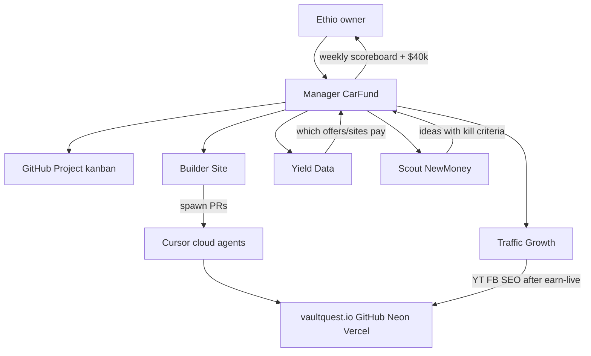

# 19 — Grok Bot operating company (VaultQuest · $40k car fund)

**Created:** 2026-08-15 · **Owner:** Ethio · **Standing teammates:** 5 Grok Bots (Manager, Builder, Traffic, Yield, Scout)
**North star:** save **$40,000 USD** toward a car. Manager reports the gap every week. No fake numbers.
**Kanban:** GitHub Project `VaultQuest · Car Fund` on `dawitrange/vaultquest`.
**Classify:** Master / ops. **Gate:** Phase 0 approved; earn-live still the revenue blocker ([docs/18-launch-orchestration.md](18-launch-orchestration.md)). **Budget:** [docs/08-budget.md](08-budget.md) — cost / lift / kill + owner yes before any spend.

This is the operating system. Paste-ready first messages live in [docs/agents/grok-bots/](agents/grok-bots/). Weekly scoreboard lives in [docs/ops/](ops/). Spawned Cursor specialists stay in [`.cursor/agents/`](../.cursor/agents/).

---

## 1. How Grok Bot works (product facts)

Grok Bot is a **standing-agent app** (desktop + iOS), not a one-off Cursor chat. Docs: [Getting started](https://cursor.com/help/grok-bot/getting-started), [Plugins](https://cursor.com/help/grok-bot/connect-plugins), [Secrets](https://cursor.com/help/grok-bot/secrets), [Plans](https://cursor.com/help/grok-bot/plans).

| Fact | Implication for VaultQuest |
|------|----------------------------|
| Sign in with the **same Cursor account**. Access needs **Ultra**, SuperGrok Heavy, or a Team Premium seat. Pro / Pro+ do not include it. | Confirm Ultra before creating bots. |
| Create agents with **name, shape, color, title**. They keep context and can save **routines** (teach once, replay on a schedule). | 5 bots, not 12. Usage resets weekly. |
| **One shared Linux VM per account.** Files, browser logins, and plugin tokens are shared across every bot. | A YouTube Studio login is visible to all five. Do not put personal-PC files on that computer. |
| **Plugins** (GitHub, Vercel, Gmail, Notion, Slack, MCP) live on the account. Connect via sidebar **Plugins** or in-chat **Connect** cards. | Secrets go in the **secure secret card**, never chat or ordinary files. |
| Sites without a plugin: **you** sign in in the Grok Bot browser. The bot does not see the password. | YouTube, Facebook Page, partner dashboards, Vercel/Neon consoles. |
| Bots can **message each other** and **launch Cursor cloud agents** (dashboard **Cloud Agents** toggle — leave **ON**). | That is how they update this repo: spawn a cloud agent → PR on `dawitrange/vaultquest`. |
| First **local-PC** action asks consent. | **Refuse.** Website / GitHub / Neon / Vercel are in scope. The owner’s PC is not. |
| No model picker. | Do not ask bots to “switch to Claude.” |
| Cursor **Automations** (`cursor.com/automations`) are the backup clock. | Monday cron writes the weekly report if a Grok routine misses. Prompt: [§9](#9-monday-cursor-automation-prompt). |

**Do not clone** the 9 Wave-1 product roles ([docs/06-agent-team.md](06-agent-team.md)) into 9 Grok Bots. Map them onto 5 standing bots. Keep `.cursor/agents/` (`@vault-planner`, `@eng-qa`, `@partner-researcher`, …) as **spawned workers** when a bot needs a repo PR or a crawl.

---

## 2. What worked vs what failed (learn first)

### Old model — [docs/03-old-model-autopsy.md](03-old-model-autopsy.md)

**Keep:** affiliate-funded rewards; YouTube + Facebook as discovery; community for giveaways.

**Kill (never revive):** “NO SURVEY OR DOWNLOAD” while requiring surveys; contact-gated manual codes; single affiliate link; gestyy shortlinks; thin “PROOF WE ARE REAL”; no in-house ledger.

### VaultQuest build (2026-08-09 → 08-14)

**Worked**

- Hybrid lock: Gamesbolt/Earnit UX + Freecash-style growth **to vaultquest.io first** + link rotation + honest giveaways.
- Wave 1 docs complete (PRD, offers mix, compliance, design). Site live with `/about` `/proof` `/earn` `/rewards` ledger + postbacks.
- SEO foundation (PR #3), copy voice realignment (PR #8), user-keyed postback credit (PR #9), admin funnel last-7d (PR #10).
- Specialist network in `.cursor/agents/` + skills (crawl, site-audit, build-check, postback-tester).
- MCP already useful: Apify, AgentMail (`vaultquest-support@agentmail.to`), Vercel, Neon.

**Did not work / still blocked revenue**

- Docs and verification theater outran a proven earn path. [docs/18-launch-orchestration.md](18-launch-orchestration.md) still lists: reseed prod so `/earn` is not dead partner homepages; get **one** network crediting VP; `OPENROUTER_API_KEY` on Vercel; owner identity/payout for partner apps.
- Marketing / YouTube **parked** until earn credits ([docs/09-wave1-status.md](09-wave1-status.md)). Paid ads gated. FB/YT rebrand posts **queued, not posted**.
- Over-signaling trust (“NO GENERATORS” billboard) hurt conversion — already rewritten in PR #8; do not regress.
- Empty GitHub Issues list = no kanban. Agents had no weekly scoreboard and no $40k number.
- Duplicate agent maps (Wave-1 9 roles vs verification swarm vs Grok Bot). Standing ops = these 5 bots.

**Rule for every bot:** copy affiliate-funded rewards + YT/community. Never revive contact-gated codes, generator claims, or “no survey” lies. Margin rule from [docs/00-master-brief.md](00-master-brief.md) still binds: never promise redemption above expected partner yield; giveaways are trust COGS from surplus margin.

---

## 3. North star: $40,000 car fund

All bots know it. **Manager cares most** and reports it every Monday.

Planning math (not a promise): user share is ~70% of partner yield (`100 VP = $1` per `SITE`). Owner gross is ~30% before fraud, support, ads, giveaways. Net might land ~15–25¢ per $1 of partner revenue. **$40k net ≈ $160k–$270k partner yield** over time.

| Pace | Net / month needed | Honest implication |
|------|--------------------|--------------------|
| 24 months | ~$1,670 | Realistic if earn is live and organic compounds |
| 12 months | ~$3,330 | Needs proven unit economics before any paid spend |
| This week | **$0 → first credited VP** | Car talk without a live earn path is slacking |

**Car Fund formula (Manager only, real numbers):**

```
cumulative = partner payouts received − Steam vault COGS − ads − tools
this week net = this week's payouts − this week's COGS/ads/tools
weeks to $40k at current run-rate = (40000 − cumulative) / max(this week net, ε)
```

If `/admin` says 0 credits, the report says **0**. Do not invent metrics or social proof.

---

## 4. Roster: 5 Grok Bots

Create these in the Grok Bot app. Paste the matching file as the **first message** after creation.



| Bot | Grok Bot title | First-message file | Owns | Does not own |
|-----|----------------|--------------------|------|----------------|
| **Manager** | Car Fund / weekly ops | [agents/grok-bots/manager.md](agents/grok-bots/manager.md) | $40k tracker, kanban, gates, budget, Product↔Offers fights, Monday report | Coding, posting, partner math in the weeds |
| **Builder** | Website shipper | [agents/grok-bots/builder.md](agents/grok-bots/builder.md) | Site PRs via cloud agents: earn UX, rotator, admin, SEO pages, bugs | Paid ads, partner ToS, posting as ZaKai |
| **Traffic** | Growth / promotions | [agents/grok-bots/traffic.md](agents/grok-bots/traffic.md) | YT `@zakai1769`, FB Page, organic posts, UTM links, Video 01 when earn is live | Spend; partner dashboards; inventing proof |
| **Yield** | Which money works | [agents/grok-bots/yield.md](agents/grok-bots/yield.md) | Postbacks, `/admin` funnel, partner EPC/CPA, rotation health, “this offer/site pays” | Shipping UI; posting |
| **Scout** | New monetization | [agents/grok-bots/scout.md](agents/grok-bots/scout.md) | Backup networks, new offer types, SEO/keyword plays, honest adjacent ideas | Shipping generators; spending without Manager+owner |

**Wave-1 role → Grok Bot map**

| Wave-1 role ([docs/06-agent-team.md](06-agent-team.md)) | Standing Grok Bot | Spawned Cursor specialist when needed |
|--------------------------------------------------------|-------------------|----------------------------------------|
| Master | **Manager** | `@vault-planner` |
| Product | Manager (economy fights) + Builder (ship) | — |
| Offers / Monetization | **Yield** | `@partner-researcher`, `@profit-ai` |
| Compliance / Trust | Manager gate + Traffic claims check | `@trust-designer` |
| Brand / Design | Builder (tokens already shipped) | `@trust-designer` |
| Engineering | **Builder** | `@eng-qa`, `@db-guardian` |
| Marketing — YouTube / Social / SEO | **Traffic** | — |
| Marketing — Paid Ads | Manager (gated) + Traffic (assets only) | — |
| New ideas / competitor deltas | **Scout** | `@competitor-researcher` |

Perspective pressure: Builder = shippable truth; Traffic = views→signups on vaultquest.io; Yield = owner margin; Scout = new yield without scam; Manager = car fund + margin rule.

---

## 5. Kanban (GitHub Project)

**Project name:** `VaultQuest · Car Fund`  
**Repo:** `dawitrange/vaultquest`  
**Columns:** `Backlog` → `This Week` → `In Progress` → `Blocked (Ethio)` → `Review` → `Done`

**Labels:** `site` `promo` `data` `idea` `car-fund` `owner-needed` `gate:earn-live`

WIP: max **3 In Progress** across the whole board. Manager moves cards. Specialists do not self-assign a fourth.

Each issue must have: **owner bot**, **done-when**, and if spend: **cost / lift / kill** per [docs/08-budget.md](08-budget.md).

Seed issues (created 2026-08-15): [#12](https://github.com/dawitrange/vaultquest/issues/12)–[#18](https://github.com/dawitrange/vaultquest/issues/18). Bodies + Project UI steps: [docs/ops/kanban-seed.md](ops/kanban-seed.md). Labels and Project v2 must be created in the GitHub UI (API 403 for this token). Close probe [#11](https://github.com/dawitrange/vaultquest/issues/11).

Weekly report path: `docs/ops/weekly-YYYY-MM-DD.md` (Monday date). Template: [docs/ops/weekly-template.md](ops/weekly-template.md).

---

## 6. Permissions (connect once on the shared Grok computer)

GitHub + this site’s Neon DB + Vercel are in scope. **Do not** sign the Grok computer into personal Drive, Photos, or banking.

### Plugins / MCP (account-level)

- GitHub (`dawitrange/vaultquest`)
- Vercel
- Neon
- Apify
- AgentMail
- Gmail **only** if it is the VaultQuest support/ops mailbox — not a personal mail dump

Secrets via Grok Bot secret card: `DATABASE_URL` (if Yield must query), `POSTBACK_SECRET` (Yield smoke only), Vercel / Apify / AgentMail tokens. Never paste into chat.

### Browser logins (owner signs in; bot never sees the password)

- YouTube Studio `@zakai1769`
- Facebook Page (`Freesteamcodes21` / `vaultquest22`)
- Partner publisher dashboards as they approve (AdGate, Lootably, Torox, BitLabs, CPX, TimeWall, …)
- Vercel + Neon consoles
- Vercel Analytics

### Leave OFF

- Local PC access
- Steam user password (**never**)
- Meta Ads until Manager + Ethio approve a test with kill criteria
- Datadog unless you actually use it (optional)

**Cloud Agents toggle:** ON.

---

## 7. Cadence

Walk through each path once in Grok Bot, then save it as a **routine**.

| When | Who | Job |
|------|-----|-----|
| **Mon 09:00** | Manager | Pull GitHub Project + `/admin` funnel + Vercel Analytics + partner payouts → write `docs/ops/weekly-YYYY-MM-DD.md` → recut This Week → ping Ethio with 5 bullets + Car Fund number |
| **Daily** | Yield | Clicks, postbacks, unhealthy links, rotation log. File issues if a link is dead. |
| **Daily** | Builder | Take the top `site` card in This Week; spawn cloud agent; open PR; move to Review. |
| **Tue / Thu / Sat** | Traffic | After **earn-live** gate: one honest post or YT step. UTM every link (`utm_source`, `utm_medium`, `utm_campaign`). |
| **Fri** | Scout | 3 monetization ideas max. Manager parks or promotes. Scout does not ship. |

**Ethio’s weekly 15 minutes:** approve/kill spend; clear `Blocked (Ethio)` (identity, ToS, keys, logo upload, posts you must click). Bots cannot accept partner ToS or tax/payout as you.

Hard gate (unchanged): **no paid spend** until landing + claims + at least one network LIVE and crediting VP.

---

## 8. Week 1 critical path

Do **not** start a content factory or paid ads. That wastes CAC on a product that cannot pay users.

1. Ethio: Ultra / Grok Bot signed in → create 5 bots → paste briefs → connect GitHub / Vercel / Neon / Apify / AgentMail → sign YouTube + Facebook in the Grok browser.
2. This pack: briefs + ops doc + kanban seed + Monday automation prompt (this file).
3. Ethio: Vercel env (`OPENROUTER_API_KEY`, `POSTBACK_SECRET`, partner secrets) + prod reseed / flip dead `AffiliateLink` rows.
4. Yield + Ethio: **one** network (CPX / TimeWall / AdGate self-serve) crediting VP.
5. Builder: prove click → postback → pending VP on production.
6. Traffic: logo PNG/JPG export + queued FB/YT posts **only after step 5**. Copy is already drafted in [docs/task_logs.md](task_logs.md) (2026-08-10 22:45).
7. Manager: first weekly file even if revenue is $0 — that is the baseline.

---

## 9. Monday Cursor Automation prompt

Create at [cursor.com/automations](https://cursor.com/automations):

- **Trigger:** scheduled, Monday 09:00 (owner timezone). Cron example: `0 9 * * 1`
- **Repository:** `dawitrange/vaultquest` (required — the run must write `docs/ops/weekly-*.md` and open a PR)
- **Tools:** pull request creation ON; GitHub comments optional; memories ON
- **Prompt (paste):**

```
You are the VaultQuest Manager backup clock.

Read docs/19-grok-bot-ops.md and docs/agents/grok-bots/manager.md in full.
Read docs/ops/weekly-template.md and the latest docs/ops/weekly-*.md if any.

North star: save $40,000 USD for a car. Do not invent metrics.

1. Collect real numbers only: GitHub Project/issues status, web/src/app/admin funnel fields if you can read code/docs, Vercel Analytics if MCP is connected, partner payout notes in docs/ops.
2. Write docs/ops/weekly-YYYY-MM-DD.md using the template (use this Monday's date).
3. Recut This Week in the issue list: keep WIP ≤ 3 In Progress. Earn-live gate still blocks paid ads and Traffic posting if no postback has credited VP.
4. Open a PR with only the weekly file (and kanban notes if you must). Title: "ops: weekly scoreboard YYYY-MM-DD".
5. PR body = 5 bullets for Ethio + Car Fund line (this week net, cumulative, weeks-to-$40k or "n/a — $0 this week").

Banned: generators, no-survey lies, Steam passwords, fake counters, contact-gated codes, paid spend proposals without cost/lift/kill.
If a number is unknown, write "unknown — owner" not a guess.
```

If Grok Bot Manager already wrote the file that Monday, the automation should **do nothing** (no duplicate PR).

---

## 10. Guardrails (every bot, every turn)

- Final goal: **save $40,000 USD for a car**. Manager reports the gap every week.
- Hybrid VaultQuest only. Traffic lands on **vaultquest.io**, not raw CPA.
- Banned: generators, “no survey” if false, Steam passwords, fake counters, contact-gated codes.
- Spend: cost / lift / kill + Ethio yes.
- Do not touch the owner’s personal PC.
- Do not invent metrics. If `/admin` says 0 credits, say 0.

---

## 11. Owner create checklist (Grok Bot app)

1. Confirm Cursor Ultra (or SuperGrok Heavy / Team Premium).
2. Open Grok Bot → sign in with the VaultQuest Cursor account.
3. Leave **Cloud Agents** ON. Refuse local-PC access.
4. Create five agents with the titles in §4. Paste each brief as the first message.
5. Plugins: GitHub, Vercel, Neon, Apify, AgentMail.
6. Browser: YouTube Studio, Facebook Page, Vercel, Neon. Partner dashboards as they approve.
7. Walk Manager through one Monday report using [docs/ops/weekly-template.md](ops/weekly-template.md) → save as routine.
8. Paste §9 into `cursor.com/automations` as backup.
9. Clear `Blocked (Ethio)` issues: OpenRouter key, prod reseed, one partner ToS/payout.

---

## Files in this pack

| Path | Purpose |
|------|---------|
| `docs/19-grok-bot-ops.md` | This operating system |
| `docs/agents/grok-bots/manager.md` | Paste into Manager |
| `docs/agents/grok-bots/builder.md` | Paste into Builder |
| `docs/agents/grok-bots/traffic.md` | Paste into Traffic |
| `docs/agents/grok-bots/yield.md` | Paste into Yield |
| `docs/agents/grok-bots/scout.md` | Paste into Scout |
| `docs/ops/weekly-template.md` | Monday scoreboard template |
| `docs/ops/weekly-2026-08-17.md` | First week file (baseline) |
| `docs/ops/kanban-seed.md` | Issue bodies + Project setup |
| `docs/06-agent-team.md` | Pointer: Grok Bots = standing ops |
| `docs/agents/main-orchestrator.md` | Route card + automation prompt pointer |
