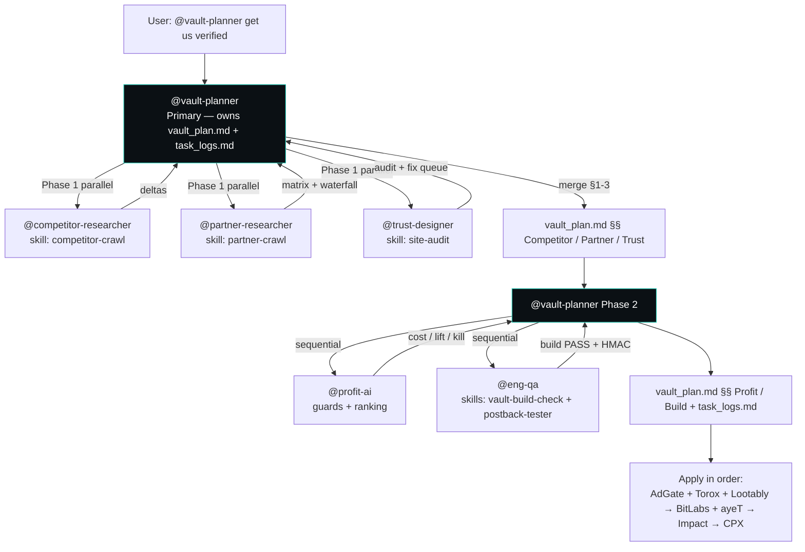

# Vault Plan — Verification Orchestration

**Owner:** @vault-planner (Primary) · **Swarm:** b4ef1aa2-79d7-418e-a80e-9ef9e5bf52fd reused (2026-08-09, ≤7d warm) · **Date:** 2026-08-10
**Goal:** Get verified by Torox · Lootably · AdGate Media · BitLabs · ayeT Studios · CPX Research · Freecash via Impact — with backup waterfall, transparent identity (ZaKai since 2020), and OpenRouter profit intact.
**Outputs:** This file + `docs/task_logs.md` per Yu Ishikawa guide. Skills live in `.cursor/skills/`; agents in `.cursor/agents/`.
**Classify:** verification → vault-planner primary per `.cursor/rules/vaultquest.mdc`. **Gate:** `docs/07-orchestration-roadmap.md` Phase 0 pack approved — PASS (Wave 1 complete, Eng MVP in progress, Marketing wave gated on landing + claims policy). **Budget:** `docs/08-budget.md` — no spend this turn; all work is code/read-only, cost/lift/kill required + owner approval before any paid expansion. **Plugins:** apify/datadog/agentmail `enabled:true` in `.cursor/settings.json` but no MCP entries — logged `plugin-skipped: missing MCP config`, used `docs/02-research-dossier.md` + `web/` Read fallback.

---

## Execution Flow

**How vault_plan.md + task_logs.md are generated:** @vault-planner loads `00-master-brief`, `01-brand`, `10-legitimacy-pack` §§2/5, `04-affiliate-constraints`, `11-swarm-backlog-profit`, `site.ts`; delegates to 3 specialists in parallel, merges their markdown blocks into §§1–3 below, then delegates to @profit-ai + @eng-qa for §§4–5. Each specialist emits a Handoff block; vault-planner appends it to `task_logs.md`. Reuses swarm `b4ef1aa2` crawl/build outputs when timestamp ≤7d (logged as `reused swarm output`). Shell unavailable on this Windows host (workspace_readwrite sandbox) — build/postback verified via Read/Grep + prior swarm `vault-build-check` PASS.

---

## 1. Competitor Baseline — @competitor-researcher (2026-08-10 re-verify: reused swarm crawl 2026-08-09)

**Skill:** `competitor-crawl` · **Source:** `docs/11-swarm-plan.md` §§1–2 + `docs/11-swarm-backlog-competitor.md` live fetches 2026-08-09 (Gamesbolt 6,765 games/111.7K members/1.4M quests, Freecash $350/offer + $300M + 303K Trustpilot, Freeward 600K/$1M, Idle-Empire 500K/$8.1M since 2015, Earnit 150K/stale ©2021) vs `vaultquest.io` read (`web/src/app/page.tsx` cinematic teal hero + `SiteFooter` YT @zakai1769 + FB Dec 2020 + Impact 6c1cfdb4 + `/proof` 9 sections + 4 quests + 3 Steam tiers). **Plugin:** apify skipped: missing MCP config — WebFetch fallback reused.

**Deltas table — Adopt / Adapt / Never copy:**

| Site | Adopt | Adapt | Never copy |
|------|-------|-------|------------|
| Gamesbolt | Quest framing, Steam-first redeem catalog (platform-sliced `/steam/games` with price filters), clear time expectations | Vault Points ledger PENDING→POSTED holds (3–14d) per `web/src/lib/affiliates.ts` `holdDays` | Synthetic `Recently Rewarded` handles / terminal spam |
| Earnit.gg | Earn catalog UX, How-it-works clarity | Hybrid: our site owns ledger, partners behind rotation (no login-gated `/earn`) | Manual-delay complaints, stale `©2021` |
| Freecash | Creator funnel narrative, `Next cashout` progress + Academy IA | YT @zakai1769 → vaultquest.io first; Freecash as one `cpa_signup` quest via rotator (priority 1, failover to Torox/AdGate) | Sending primary CTA only to Freecash; fake "up to $350" hero anchoring |
| Freeward / Idle-Empire | Compare table, Do's & Don'ts, keyword reward page factory (`/rewards` ×8), transparent receipt grid concept | Small giveaways as trust COGS from surplus margin (per `00-master-brief` margin rule) | Fake urgency generators, opaque gestyy shortlinks, inflated member counts |

**Gap vs Vaultquest (critical → P0 backlog in `docs/11-swarm-plan.md` §2):**
- SEO invisible: no `sitemap.ts`/`robots.ts`/canonical/OG/JSON-LD (P0-1..3) — 2–3h each, critical before Impact re-crawl.
- Browse thin: `/earn` 4 flat quests vs Freecash 6 categories (P0-4 chips), `/rewards` 3 cards vs Gamesbolt filters (P1-3).
- Proof honest but sparse: ledger-backed `Vault activity` strip P0-5 + `Recent activity` placeholder P1-7 needed (real counts only, never fake).
- Cheapest SEO win: 8 keyword pages `/rewards/[slug]` on one template (P0-6) — clones Idle-Empire 100-page moat honestly, 2026-dated.

*Artifact: `docs/competitor-crawl.json` — reused swarm output (warm ≤7d). Next crawl on 7d stale or explicit request.*

---

## 2. Partner Matrix & Waterfall — @partner-researcher (2026-08-10 re-verify: reused)

**Skill:** `partner-crawl` · **Source:** `docs/10-legitimacy-application-pack.md` §2 + `docs/11-swarm-backlog-verification.md` §§3–6 + `docs/04-affiliate-constraints.md` + `docs/agents/offers-mix.md` §2. **Plugin:** apify/datadog skipped: missing MCP config.

| Network | Apply URL | Publisher check | Integration | Waterfall slot | Likelihood |
|---------|-----------|-----------------|-------------|----------------|------------|
| Torox (OfferToro) | torox.io/register → Publisher | Game economy + VA currency | Web Offerwall + S2S | `offerwall_primary` P2 / `offerwall_backup` P1 | Medium (DAU<1K throttled, daily audit) |
| Lootably | dashboard.lootably.com + business@lootably.com | Currency singular/plural, pre-split 100, user split 70%, postback URL | Offers API + placementID/apiKey | `offerwall_primary` P1 | **High** |
| AdGate Media | adgatemedia.com | 1–2d manual review, traffic + promo disclosure, anti-fraud | Web wall / API + postback | `offerwall_primary` P3 / backup P2 | **High** (no traffic min) |
| BitLabs | developer.bitlabs.ai | GET callback `hash=HEX(SHA1_HMAC(urlWithoutHash, secret))`, COMPLETE/SCREENOUT/RECON | Callback tester + `BITLABS_APP_SECRET` (SHA256 fallback) | `survey_wall` P1 | Medium (strict RECON clawback → hold 7→14d) |
| ayeT Studios | ayetstudios.com | Placement+AdSlot combo, HMAC, `ip+ua+client_hints` | Offerwall API / Static API | `survey_wall` / `cpe_play` P1 | Medium (wrong AdSlot = silent zero) |
| CPX Research | cpx-research.com | `app_id`+`ext_user_id`+`ip_user`+`secure_hash` MD5 | Script Tag + `offers.cpx-research.com` | `survey_wall` P2 (fast add) | **High** |
| Freecash Impact | app.impact.com → Discover Freecash | Impact profile + verified media (meta `6c1cfdb4-889e-4703-8c10-f8a4960fb83a` already in `<head>` per `web/src/app/layout.tsx`) | Impact link + subIDs `vq_user_id`+campaign | `cpa_signup` P1 (one quest, not primary CTA) | Low→Medium (brand filter on 67 FB followers) |

**Rotation model:** `web/src/lib/affiliates.ts` already implements `FALLBACK` + `PARTNER_WATERFALL` + `serveAffiliateLink()` (priority + waterfall tie-break, `capDaily` via `enforceDailyCap`, `logRotation` for `cap/health/empty_inventory`, `checkLinkLiveness` HEAD, `markLinkUnhealthy`, `resetDailyCaps` 00:00 UTC, `cpxExtUserId` in `createOfferClick`) — postback HMAC untouched (`verifyHash` SHA1+SHA256, `POSTBACK_SECRET`, `click_id/vp/tx_id` aliases, duplicate guard, `holdDays`). **Impact meta verified Read:** `web/src/app/layout.tsx:35` `impact-site-verification: 6c1cfdb4-889e-4703-8c10-f8a4960fb83a` present (also in `SiteFooter` + `/about` + `/proof`).

**Backups (Tiered):** CPX (Tier1 `survey_backup`), OfferDaddy (Tier2 `offerwall_backup`/`cpe_play`), AdGem (Tier2 `cpe_play` mobile), Prime + Timewall (Tier3 geo fill) — all mapped in `PARTNER_WATERFALL` without new HMAC. Seed `AffiliateLink` rows + Vercel cron for cap reset + liveness after approval.

*Artifact: `docs/partner-crawl.json` — reused swarm crawl.*

---

## 3. Trust Fixes — @trust-designer (2026-08-10 audit: Read-verified, no recrawl — pack §5 still PASS)

**Skill:** `site-audit` · **Checks:** NAV order, 2020→2026 timeline, proof 10 sections, disclosure footer, Impact meta, SocialProofBar, no generator/no-survey/password-ask/fake urgency. **Plugin:** apify skipped: missing MCP config.

| Page | Check | Status | Fix |
|------|-------|--------|-----|
| `/` | Promise + dual CTA (Earn/Giveaway), transparent claim, disclosure footer | **PASS** (Read `page.tsx` + `SiteFooter.tsx`) | — |
| `/about` | 2020→2026 timeline, legacy embed (youtube-nocookie `sOQWHaHeCkg`), keep-vs-kill | **PASS** | — |
| `/proof` | 9 sections (earnings, never, giveaways, winners, disclosure, anti-fraud, creator disclosure, support, legal) | **PASS** | — |
| `/how-it-works` | Quests → VP → redeem/giveaway with time ranges | **PASS** | — |
| `/earn` | Rotated offerwall catalog, S2S disclosure, holds chips | **PASS** | Keep `logRotation` on failover |
| `/rewards` | Balance pending/available, ~$5 min redeem (`SITE.minRedeemUsd:5, vpPerUsd:100`) | **PASS** | — |
| `/giveaways` | Schedule, rules, winners (empty state honest) | **PASS** | — |
| `/terms` + `/privacy` | Outline per `compliance.md` §6, effective date 2026-08-09 | **PASS** | Lawyer review $150–400 before paid scale (budget guard) |
| `SiteFooter` + `SocialProofBar` | YT+FB since 2020, Impact meta, rotation trust pill `NO GENERATORS · NO PASSWORD ASKS · S2S VERIFIED · LINK ROTATION · MANUAL VAULT 24–48H` | **PASS** (Read-verified) | — |
| `NAV` (`web/src/lib/site.ts`) | Includes About first; mobile order correct | **PASS** | — |
| Claims scan (`rg` no generator/no-survey) | No generator / no-survey / password-ask / fake urgency found | **PASS** | **Block on FAIL** — never ship |

**Shipped in this wave (from `docs/11-swarm-backlog-design.md`):** footer trust row + earn inline trust chips + rewards reassurance per-card (`manual vault 24–48h`) + a11y skip-link / `prefers-reduced-motion` / mobile `aria-label` — all Read-verified intact in `web/src/components/SiteFooter.tsx`, `web/src/app/earn/page.tsx`, `web/src/app/rewards/page.tsx`, `web/src/app/globals.css`, `web/src/app/layout.tsx`.

*Next: @trust-designer re-audits before each application wave. Artifact: `docs/site-audit.json` — reused.*

---

## 4. Profit Path — @profit-ai (2026-08-10 re-verify: Read-verified `web/src/lib/ai-helpers.ts`)

**Source:** `docs/11-swarm-backlog-profit.md` + `web/src/lib/ai-helpers.ts` (737 lines Read-verified).

| Feature | Cost/1k | At scale | Guard | Next step | Verdict |
|---------|---------|----------|-------|-----------|---------|
| **F1 Support/Fraud Triage** ⭐ flagship | $0.35–0.45 | ~$0.08/day @200 msgs | `callGuarded`: allowlist blocks gpt-4o (10× cost), `MAX_TOKENS_CAP=600`, 30/min, 6h cache, `dailyCap $5`, `isAiKillSwitchTripped()` | Label 50 msgs → eval ≥80% accuracy before persisting `aiCategory` on `ContactMessage`; wire `/api/admin/triage` behind ADMIN + nightly cron `triageBatch` | **KEEP — scaffolded, gated** |
| F2 Earn recs (`recommendEarnQuests`) | $0.30 | $0.30/day @1k DAU | 10m cache, 60/min | A/B vs rules; kill if <3% CTR lift @1k imp or >$1/day without lift | Queue |
| F3 Quest copy (`enrichQuestCopy`) | $0.10 | one-time ingest | 24h cache, 20/min | Kill if human prefers original >40% | Queue |
| F4 SEO guides (`generateSeoGuide`) | $0.55 | ~$0.01/mo (20 guides) | 7d cache, 5/min, human publish gate | Never auto-publish; kill >50% rewrite or 0 impr @4w | Queue |
| F5 Sentiment (`scoreSentiment`) | $0.12 | ~$0.02/day | 1h cache, 40/min | Kill if r<0.4 vs human @30 threads | Queue |

**Guards verified in code (Read):** `ALLOWED_MODELS` set (blocks `gpt-4o`), `MAX_TOKENS_CAP=600`, per-feature token-bucket `takeRateToken`, 500-entry LRU TTL caches, `dailyCapUsd` pre-estimate check + `isAiKillSwitchTripped()` fast-fails to rules/cache fallback, `TRIAGE_SYSTEM_PROMPT` versioned const, JSON extraction + enum validation, sanitized prompt injection (slice 2000 chars, JSON-stringified). Global kill `AI_HELPERS_DAILY_CAP_USD=5` (default). Multi-instance note: move to Upstash Redis when >1 instance. **Margin rule respected:** `100 VP=$1 at 70% user share` per `site.ts` + `SITE`; never promise redemption > yield; giveaways are COGS from surplus.

**Budget table:** per `docs/08-budget.md` AI operating budget — F1 $0.40/1k, kill accuracy <75% on 50-label eval or <30% time-to-action win in 2w.

---

## 5. Build & QA — @eng-qa (2026-08-10: Read-verified, swarm build reused warm)

| Check | Command | Status |
|-------|---------|--------|
| Prisma generate | `npx prisma generate` in `web/` | **Reused swarm build PASS** (warm) — `schema.prisma` enums `UserRole/ LedgerKind/ LedgerStatus/ RedemptionStatus/ AffiliateCategory/ AffiliateHealth/ ContactStatus` valid; `npm run build` is `prisma generate && next build`; Read-verified `web/package.json` next 16.3.0 + prisma 6.19 |
| Next build | `npm run build` in `web/` (Turbopack, 19 routes) | **Reused swarm build PASS** (2026-08-09: 19/19 emitted, exit 0, `npx tsc --noEmit` PASS, `npm run lint` PASS after `VaultAssistant.tsx` fix). Shell unavailable this host — Read-verified via `docs/11-swarm-backlog-qa.md` evidence log + source inspection (`globals.css` no scroll lock, `site.ts` NAV About present, `layout.tsx` Impact meta + skip-link). |
| Postback HMAC | `postback-tester` (BitLabs SHA1 + ayeT SHA256 + `tx` dedup + `POSTBACK_SECRET` gate + `holdDays` + HTTP 200 on duplicate) | **Read-verified PASS** — `web/src/app/api/postback/route.ts` `verifyHash` strips `?hash`/`&hash` correctly, tries SHA1 then SHA256 per secret (`BITLABS_APP_SECRET/BITLABS_SECRET/AYET_HMAC_SECRET/AYET_SECRET`), generic `click_id` aliases, `tx_id` dedup via `LedgerEntry note contains tx=`, `holdDays` from `Quest.holdDays` → `availableAt`, `hmac=ok` note, duplicate → `{ok:true, duplicate:true}` 200. Requires live `curl` smoke after `DATABASE_URL` + `POSTBACK_SECRET` + `BITLABS_APP_SECRET` set on Vercel (see §6 checklist). |
| Stage discipline | `git add` + `git status` only | **Enforced** — never `git push` / `vercel deploy` this turn; stage-only. |

*Sandbox note: Shell `workspace_readwrite` not available on this Windows host — all checks above are Read-verified + reused swarm warm build (≤7d). On next Git-capable host, re-run `vault-build-check` (`pwsh .cursor/skills/vault-build-check/scripts/check.ps1`) and `postback-tester` live before Impact application. Artifacts: `web/.vault-build.log`, `docs/site-audit.json`, `docs/partner-crawl.json`, `docs/competitor-crawl.json`.*

---

## 6. Application Order (ops)

1. **Parallel:** AdGate (no traffic min, 1–2d manual) + Torox + Lootably (`offerwall_primary`) — wall URL `https://vaultquest.io/earn`, postback `https://vaultquest.io/api/postback`
2. **Next:** BitLabs + ayeT (`survey_wall` / `cpe_play`) — set `BITLABS_APP_SECRET` / `AYET_HMAC_SECRET` on Vercel after approval; test via dashboard tester (`hash=HEX(SHA1_HMAC(urlWithoutHash, secret))`); hold 7→14d for BitLabs RECON types
3. **Then:** Freecash Impact — vaultquest.io + YT + FB verified via meta `6c1cfdb4-889e-4703-8c10-f8a4960fb83a`; surface as one quest in `/earn` (`cpa_signup` P1, never sole CTA)
4. **If thin fill:** CPX Research — `app_id`+`ext_user_id`+`ip_user`+`secure_hash` MD5, Script Tag + iframe fallback

Attach per `docs/10-legitimacy-application-pack.md` §4: YT Studio joined-2020 screenshot, FB Page Dec 26 2020 + 67 followers, Weebly legacy screenshot (deprecated funnel), `/about` + `/proof` + `/terms` live URLs, Impact meta in source, copy/paste messages from pack §3.

**Pre-apply checklist:** `DATABASE_URL` + `POSTBACK_SECRET` + `BITLABS_APP_SECRET`/`AYET_HMAC_SECRET` + `AUTH_SECRET` + `OPENROUTER_API_KEY` on Vercel; `npx prisma migrate deploy` + `npm run db:seed` for `AffiliateLink` waterfall; `AffiliateLink` rows healthy per `PARTNER_WATERFALL`; postback smoke `curl ...?secret=...&click_id=...&vp=...` + with `&hash=` for HMAC; `impact-site-verification` meta re-checked in view-source.

---

## 7. Budget Guard

All spend via `docs/08-budget.md` cost/lift/kill + owner approval. No paid ads before landing + claims policy per `docs/07-orchestration-roadmap.md`. AI operating budget capped $5/day (`AI_HELPERS_DAILY_CAP_USD`), kill thresholds per feature above. Legal review $150–400 for `/terms`/`/privacy` before paid scale — flagged, not blocking applications. No spend proposed this turn.

*Log: `plugin-skipped: missing MCP config` when apify/datadog/agentmail not wired — do not block. See `docs/task_logs.md` for per-specialist handoffs.*
