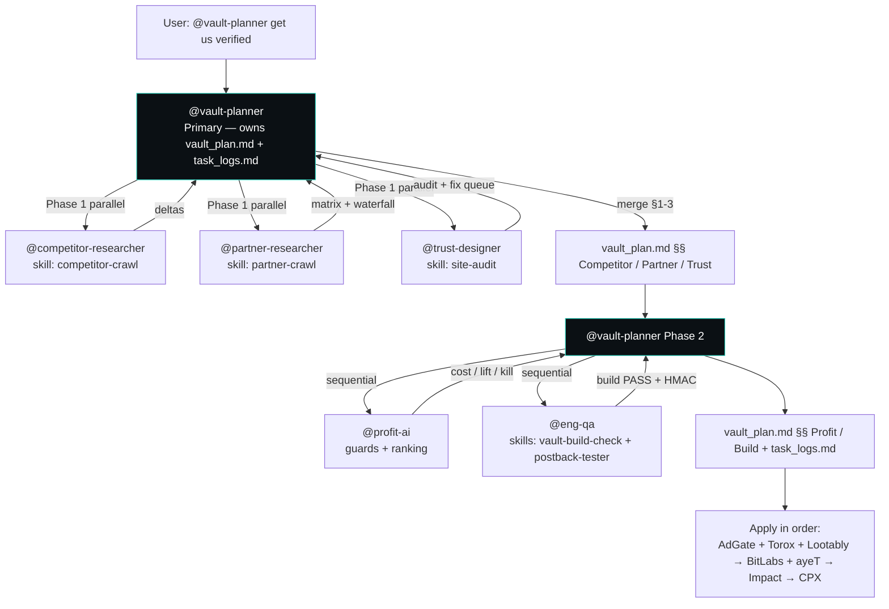

# Vault Plan — Verification Orchestration

**Owner:** @vault-planner (Primary) · **Swarm:** b4ef1aa2-79d7-418e-a80e-9ef9e5bf52fd reused · **Date:** 2026-08-09
**Goal:** Get verified by Torox · Lootably · AdGate Media · BitLabs · ayeT Studios · CPX Research · Freecash via Impact — with backup waterfall, transparent identity (ZaKai since 2020), and OpenRouter profit intact.
**Outputs:** This file + `docs/task_logs.md` per Yu Ishikawa guide. Skills live in `.cursor/skills/`; agents in `.cursor/agents/`.

---

## Execution Flow

**How vault_plan.md + task_logs.md are generated:** @vault-planner loads `00-master-brief`, `01-brand`, `10-legitimacy-pack`, `04-affiliate-constraints`, `11-swarm-backlog-profit`, `site.ts`; delegates to 3 specialists in parallel, merges their markdown blocks into §§1–3 below, then delegates to @profit-ai + @eng-qa for §§4–5. Each specialist emits a Handoff block; vault-planner appends it to `task_logs.md`. Reuses swarm `b4ef1aa2` crawl/build outputs when timestamp ≤7d (logged as `reused swarm output`).

---

## 1. Competitor Baseline — @competitor-researcher

*Populated by @competitor-researcher via `competitor-crawl`. Reuses swarm crawl if available.*

| Site | Adopt | Adapt | Never copy |
|------|-------|-------|------------|
| Gamesbolt | Quest framing, Steam-first redeem catalog, clear time expectations | Vault Points ledger with pending → available holds | Synthetic redemption feeds |
| Earnit.gg | Earn catalog UX, How-it-works clarity | Hybrid: our site owns ledger, partners behind rotation | Single dead CTA |
| Freecash | Creator funnel narrative | YT @zakai1769 → vaultquest.io first; Freecash as one quest via rotator | Sending primary CTA only to Freecash |
| Freeward / Idle-Empire | Light daily/streak, transparent copy | Small giveaways as trust COGS from surplus margin | Fake urgency generators, opaque gestyy shortlinks |

*Source: `docs/competitor-crawl.json` (or reused `docs/11-swarm-plan.md` crawl). Next crawl: on @vault-planner invocation or 7d stale.*

---

## 2. Partner Matrix & Waterfall — @partner-researcher

*Source of truth: `docs/10-legitimacy-application-pack.md` §2. Revalidated via `partner-crawl`.*

| Network | Apply URL | Publisher check | Integration | Waterfall slot |
|---------|-----------|-----------------|-------------|----------------|
| Torox (OfferToro) | torox.io/register → Publisher | Game economy + VA currency | Web Offerwall + S2S | `offerwall_primary` P2 / `offerwall_backup` P1 |
| Lootably | dashboard.lootably.com + business@lootably.com | Currency singular/plural, pre-split 100, user split 70%, postback URL | Offers API + placementID/apiKey | `offerwall_primary` P1 |
| AdGate Media | adgatemedia.com | 1–2d manual review, traffic + promo disclosure, anti-fraud | Web wall / API + postback | `offerwall_primary` P3 / backup P2 |
| BitLabs | developer.bitlabs.ai | GET callback `hash=HEX(SHA1_HMAC(urlWithoutHash, secret))`, COMPLETE/SCREENOUT/RECON | Callback tester + `BITLABS_APP_SECRET` | `survey_wall` P1 |
| ayeT Studios | ayetstudios.com | Placement+AdSlot combo, callback HMAC, ip+ua+client_hints | Offerwall API / Static API | `survey_wall` / `cpe_play` P1 |
| CPX Research | cpx-research.com | `app_id`+`ext_user_id`+`ip_user`+`secure_hash` MD5 | Script Tag + `offers.cpx-research.com` | `survey_wall` P2 (fast add) |
| Freecash Impact | app.impact.com → Discover Freecash | Impact profile + verified media (meta `6c1cfdb4-889e-4703-8c10-f8a4960fb83a` already in head) | Impact link + subIDs `vq_user_id`+campaign | `cpa_signup` P1 (one quest, not primary CTA) |

**Rotation model:** `docs/04-affiliate-constraints.md` — serve highest priority healthy + under-cap link per category; on `capped|disabled|unhealthy|empty_inventory` failover + log `category, link_id, partner, reason`. Impact meta verified in `web/src/lib/site.ts` head.

*Artifact: `docs/partner-crawl.json`. Swarm reuse: if `docs/11-swarm-plan.md` crawl ≤7d, log `reused swarm crawl`.*

---

## 3. Trust Fixes — @trust-designer

*Audited via `site-audit` skill.*

| Page | Check | Status | Fix |
|------|-------|--------|-----|
| `/` | Promise + dual CTA (Earn/Giveaway), transparent claim, disclosure footer | PASS (per pack §5) | — |
| `/about` | 2020→2026 timeline, legacy embed (youtube-nocookie), keep-vs-kill | PASS | — |
| `/proof` | 10 sections (earnings, never, giveaways, winners, disclosure, anti-fraud, creator disclosure, support, legal) | PASS | — |
| `/how-it-works` | Quests → VP → redeem/giveaway with time ranges | PASS | — |
| `/earn` | Rotated offerwall catalog | PASS | Keep rotator logging |
| `/rewards` | Balance pending/available, ~$5 min redeem | PASS | — |
| `/giveaways` | Schedule, rules, winners (empty state until first draw) | PASS | — |
| `/terms` + `/privacy` | Outline per `compliance.md` §6 | PASS | Lawyer review $150–400 before paid scale (budget flag) |
| `SiteFooter` + `SocialProofBar` | YT+FB since 2020, Impact meta, rotation trust pill | PASS | — |
| NAV | Includes About; mobile order correct | PASS | — |
| Claims scan | No generator / no-survey / password-ask / fake urgency found | PASS | Block on FAIL |

*Next: @trust-designer re-audits on every pre-apply. Artifact: `docs/site-audit.json`.*

---

## 4. Profit Path — @profit-ai

*Source: `docs/11-swarm-backlog-profit.md` + `web/src/lib/ai-helpers.ts`.*

| Feature | Cost/1k | At scale | Guard | Next step |
|---------|---------|----------|-------|-----------|
| **F1 Support/Fraud Triage** ⭐ flagship | $0.35–0.45 | ~$0.08/day @200 msgs | `callGuarded`: allowlist blocks gpt-4o, 30/min, 6h cache, dailyCap $5, `isAiKillSwitchTripped()` | Label 50 msgs → 80% accuracy eval before persisting `aiCategory` |
| F2 Earn recs | $0.30 | $0.30/day @1k DAU | 10m cache | A/B vs rules; kill <3% CTR lift |
| F3 Quest copy | $0.10 | one-time ingest | 24h cache | Human prefers >60% |
| F4 SEO guides | $0.55 | ~$0.01/mo (20 guides) | 7d cache, human publish gate | Never auto-publish |
| F5 Sentiment | $0.12 | ~$0.02/day | 1h cache | r≥0.4 vs human |

Global kill: `AI_HELPERS_DAILY_CAP_USD=5`. Multi-instance → Upstash Redis later. Prompt injection: JSON-stringified + sliced 2000 chars, enum-validated, no tool calls.

---

## 5. Build & QA — @eng-qa

| Check | Command | Status |
|-------|---------|--------|
| Prisma generate | `npx prisma generate` in `web/` | Reused swarm build if warm; else run `vault-build-check` |
| Next build | `npm run build` in `web/` | Reused swarm build if warm; smoke: `vault-build-check --help` |
| Postback HMAC | `postback-tester` (BitLabs SHA1 + ayeT, tx dedupe) | Requires dev server; `--help` smoke otherwise |
| Stage discipline | `git add` + `git status` only | Never `git push` / `vercel deploy` |

*Artifacts: `web/.vault-build.log`, `docs/site-audit.json`, `docs/partner-crawl.json`, `docs/competitor-crawl.json`.*

---

## 6. Application Order (ops)

1. **Parallel:** AdGate (no traffic min) + Torox + Lootably (`offerwall_primary`)
2. **Next:** BitLabs + ayeT (`survey_wall` / `cpe_play`) — set `BITLABS_APP_SECRET` / `AYET_HMAC_SECRET` on Vercel after approval; test via dashboard tester
3. **Then:** Freecash Impact — vaultquest.io + YT + FB verified via meta; surface as one quest in `/earn`
4. **If thin fill:** CPX Research

Attach per `docs/10-legitimacy-application-pack.md` §4: YT Studio joined-2020, FB Page Dec 26 2020, Weebly legacy screenshot, `/about` + `/proof` + `/terms` live URLs, Impact meta in source.

---

## 7. Budget Guard

All spend via `docs/08-budget.md` cost/lift/kill + owner approval. No paid ads before landing + claims policy per `docs/07-orchestration-roadmap.md`.

*Log: `plugin-skipped: missing MCP config` when apify/datadog/agentmail not wired — do not block.*
